<h1 align="center">ATM</h1>

  

## Description
The ATM application is a convenient and intuitive interface for interacting with an ATM. Developed using `C#` and the `.NET Framework` and `.NET Core` platforms, it represents a comprehensive solution that combines the capabilities of both platforms. The application provides users with a wide range of banking operations, including *balance inquiry*, *account replenishment*, *cash withdrawal*, *phone number top-up*, *fund transfer*, and *card termination*. The intuitive user interface, created using `Windows Forms`, makes the interaction process simple and secure. Thus, users can efficiently utilize the banking services provided by this application while enjoying its high level of security.

PIN: `1111`

## Key Features
### ATM and Language Selection
Upon application launch, users can select the desired ATM from the list of available options and set their preferred interface language (Russian, English, Ukrainian), ensuring a personalized user experience.
### Card Interaction
The process of starting work with the ATM begins with inserting the card into the device. This stage is executed through an intuitively understandable method of dragging the card into the ATM slot, simplifying and speeding up the process. After inserting the card, the initialization of the process occurs, displayed through a progress indicator `ProgressBar`, which shows the progress of card recognition and PIN entry.
### Operation Initialization
To track the progress of PIN entry and card recognition, the application uses a progress indicator (ProgressBar), providing users with visual feedback on the current state of the process.
### PIN Code Security
User data security is ensured by setting limitations on PIN code entry. Users are provided with three attempts for correct entry. Upon exceeding the limit, the card is blocked, protecting against unauthorized access.
### Card Operations
Users have the ability to perform a wide range of card operations, including balance inquiry, account replenishment, cash withdrawal, phone number top-up, fund transfer to another card, and card termination. This ensures maximum flexibility and convenience in using the application.
### User-Friendly Interface
By using Windows Forms elements such as `PictureBox`, `TextBox`, `Button`, `ProgressBar`, `MaskedTextBox`, `Label`, and `Timer`, the application provides an attractive and intuitive interface, facilitating comfortable and efficient user interaction. Additionally, to enhance convenience, the interface supports the selection of application and ATM language immediately upon launch.

## Used Technologies
The application is developed in the `C#` programming language, which provides powerful tools for creating high-quality applications. 

The `.NET Framework` and `.NET Core` platforms were used for application development and operation, ensuring flexibility and compatibility with various operating systems. 

`Windows Forms` was chosen as the platform for creating the graphical interface of the application, providing an intuitive and appealing user experience.

## Limitations and Settings
To ensure ease of use and security of the application, various limitations and settings were programmatically established. For example, the application form is centered on the screen, making its location convenient for the user. Additionally, resizing of the form is prohibited to prevent accidental changes to the application's appearance and dragging forms is also prohibited. 

For security purposes, the minimize, maximize, and close buttons of the form are hidden to prevent accidental application closure by the user. Restrictions on image sizes are also set to guarantee their proper display in the interface. 

An important aspect of security is the restriction of accessibility to the PIN code entry field, making it impossible for unauthorized users to modify or interfere with it, thereby ensuring the protection of user data and privacy.

## Application overview

### Choose ATM Form

  
<b>Screenshot</b>

  
  | 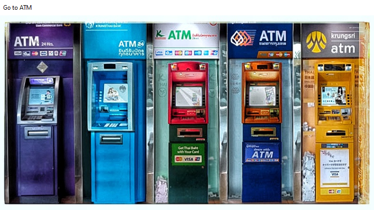 | 
  | :--: | 
  | *Choose ATM Form* |

Here you can select any of the available ATMs and then proceed to select the language to use the ATM.

### Choose Language Form

  
<b>Screenshot</b>

  
  | 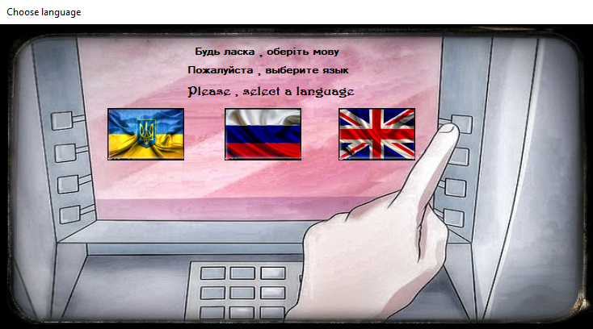 | 
  | :--: | 
  | *Choose Language Form* |

Here you can choose any language that is convenient for you: *Ukrainian, Russian or English*.

### Insert Card Form

  
<b>Screenshot</b>

  
  | 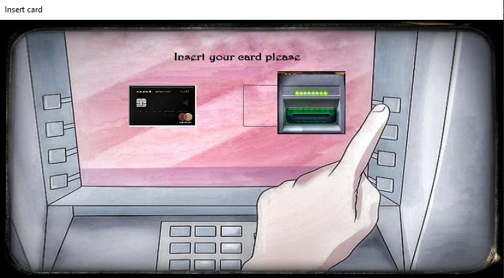 | 
  | :--: | 
  | *Insert Card Form* |

Here you should insert your card into the ATM to initialize it and continue using the services. To do this, you just need to *`grab the card and drag it into the ATM slot`*. Also wait for initialization.

### Recognition Card Form

  
<b>Screenshot</b>

  
  | 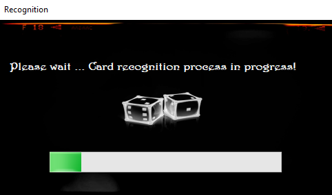 | 
  | :--: | 
  | *Recognition Card Form* |

Here you will track the progress of the ATM recognizing your card. Once a certain scale reaches its maximum value, you will move on to the next step.

### Enter PIN Form

  
<b>Screenshot</b>

  
  | 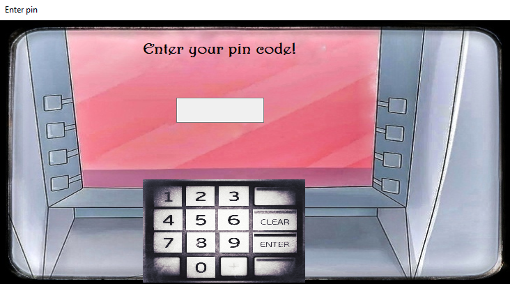 | 
  | :--: | 
  | *Enter PIN Form* |

Here you need to enter your card PIN. Make sure you enter it correctly, otherwise after *`three incorrect entry`* attempts your card will be blocked indefinitely. 

Also, if you enter an incorrect PIN code, you will see a notification about this, and you will also see the `number of remaining attempts` to enter the correct PIN code so that your card is not blocked.

PIN: `1111`

### Blocked Card Form

  
<b>Screenshot</b>

  
  | 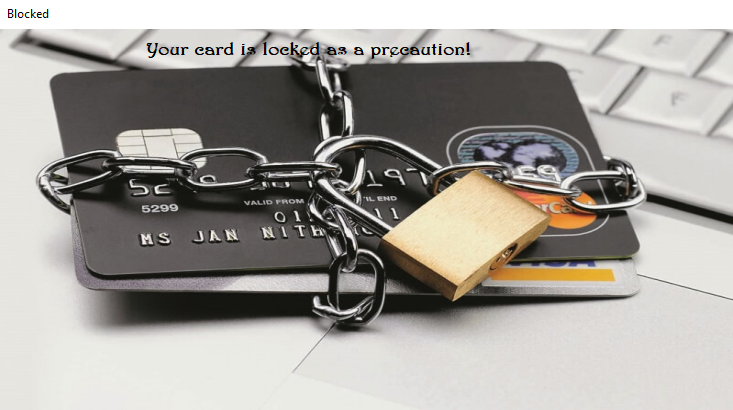 | 
  | :--: | 
  | *Blocked Card Form* |

Here you will only see a notification that after three consecutive unsuccessful attempts to enter the correct PIN code, your card has been blocked indefinitely.

### Operation Form

  
<b>Screenshot</b>

  
  | 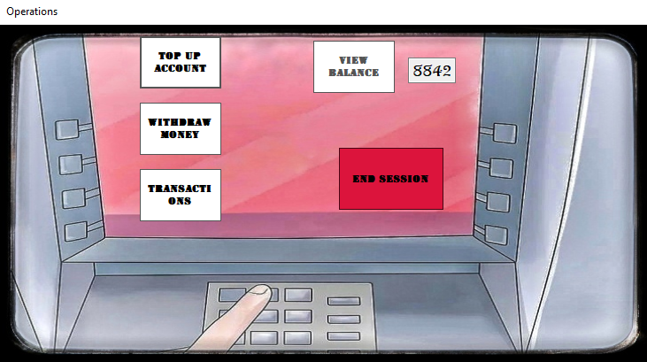 | 
  | :--: | 
  | *Operation Form* |

Here you can choose one of five operations:
* `View balance`
* `Top up account`
* `Withdrawing money`
* `Transactions` - *Including topping up a phone number and transferring to another card.*
* `End session`

*`Note:`* *To start using transactions, you first need to view your card balance.*

### Top Up Form

  
<b>Screenshot</b>

  
  | 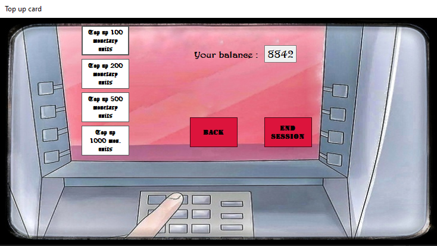 | 
  | :--: | 
  | *Top Up Form* |

Here you can select the amount to top up your balance:
* `100 UAH`
* `200 UAH`
* `500 UAH`
* `1000 UAH`

You will also have additional options, such as: 
* `Go back`
* `End the session`

There is also a window for displaying the current balance.

### Replenishment Form

  
<b>Screenshot</b>

  
  | 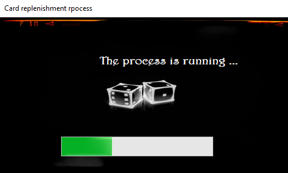 | 
  | :--: | 
  | *Replenishment Form* |

Here you can see the initialization of the top-up process. Once this process is complete, you can continue with any other actions.

### Withdraw Form

  
<b>Screenshot</b>

  
  | 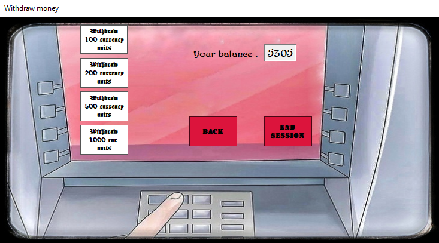 | 
  | :--: | 
  | *Withdraw Form* |

Here you can select the amount to withdraw money:
* `100 UAH`
* `200 UAH`
* `500 UAH`
* `1000 UAH`

You will also have additional options, such as: 
* `Go back`
* `End the session`

There is also a window for displaying the current balance.

`Note:` You will not be able to withdraw more money than you have on your balance. If you try to do this, you will see a notification that there is not enough money in your balance. *It appears for 3 seconds*

### Withdrawal Form

  
<b>Screenshot</b>

  
  | 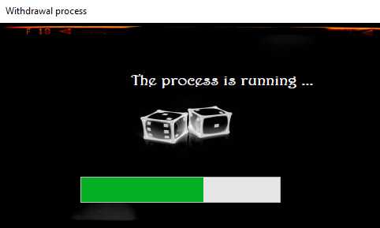 | 
  | :--: | 
  | *Withdrawal Form* |

Here you can see the initialization of the process of withdrawing money from the account. Once this process is complete, you can continue with any other actions.

### Transaction Form

  
<b>Screenshot</b>

  
  | 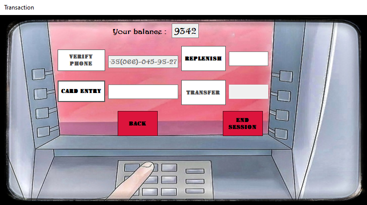 | 
  | :--: | 
  | *Transaction Form* |

Here you have the opportunity to perform two actions, namely:
* `Mobile phone number replenishment`
* `Transfer money to another card`

You will also have additional options, such as: 
* `Go back`
* `End the session`

In order to top up a mobile phone number, *you will first need to verify the phone number*, and only then you can enter the top-up amount.

Also for transferring to another card. *First, enter the number of the card to which you want to make a transfer, verify it, and then enter the amount and complete the operation.*

*If you have less money on your balance than you want to send to another card or top up your phone number, you will see a notification about this.*

All actions will take some time, so you will see the process completion time, which you will have to wait.

There is also a window for displaying the current balance.

## Project setup
On Windows platform: 
*Download [archive](./ATM_Release.rar) which has all needed application components. The application can be started by opening the `.exe` file.*
